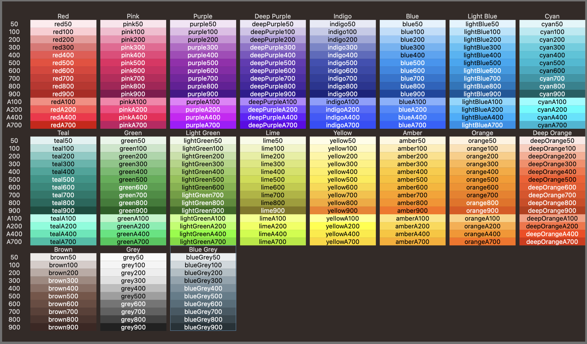
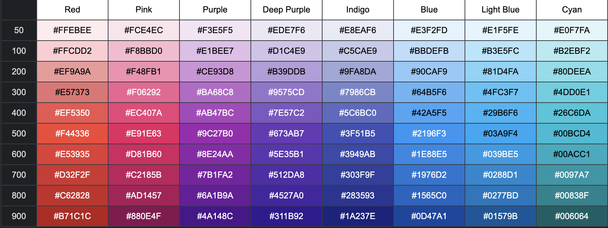

# Material Design Colors by Google
SwiftUI-Version


  

---

[](https://youtu.be/xYkz0Ueg0L4?t=0s)

머티리얼 디자인에서 제공하는 색상 팔레트가 있다. 컬러 툴 사이트를 사용하면 UI의 메인 컬러로 정해졌을 때의 전체적인 색 느낌을 볼 수 있다. 사이트에서 팔레트에 있는 정해진 색 말고도 커스텀 색으로 고를 수 있긴 하다.

위의 소개 영상에 나오듯 이 세상에 잘못된 색은 없다. 단지 우리가 고를 수 있는 색의 스펙트럼은 너무 많기 때문에 그중에 전문가들이 검증하여 사용하기 좋게 만들어진 팔레트 중 하나가 이 머티리얼 컬러 팔레트일 뿐이다. 즉 여기에 있는 색을 사용하는 게 다른 색들 보다 무조건 효과적이라고 생각하기 보다는, UI에 사용하기 좋도록 밝기를 체계적으로 나누어 놓은 좋은 견본이라고 보면 된다. 따라서 자신의 UI 컨셉에 특별히 정확한 색상값이 정해진 게 아니라면 이 팔레트에 있는 색을 사용하면 좀 더 쉽게 효과적으로 만들 수 있다.

아래는 머티리얼 디자인에서 사용하는 색 팔레트를 표로 나타낸 것이다. 색의 배경에 따라 글씨색이 검은색(#000)과 흰색(#FFF)으로 다른데, 저시력자를 위한 최소 대비에 맞도록 머티리얼 디자인에서 권장하는 글씨 색으로 나무위키에서 표를 만들 때 참고해도 도움이 된다. 색에 따른 정확한 판독성(legibility)을 확인하고 싶다면, 위의 컬러 툴 사이트에서 상단 Accessibility 탭에 들어가면 선택한 색을 배경으로 사용했을때 각종 텍스트의 판독성에 관한 다양한 정보를 볼 수 있다.

색 이름은 맨위의 영어 이름과 숫자를 합쳐서 읽는다. 예를들어 Blue 300은 #64B5F6이다. 중심이 되는 색 500을 기점으로 10가지의 밝기로 나누어져 있다. 추가로 숫자 앞에 A가 붙은 4가지 색은 채도가 높아 눈에 가장 먼저 들어오는 색으로, 행동을 유도하기 위한 메인 액션 버튼에 사용하기 좋다.

* 출처
[나무위키](https://namu.wiki/w/%EB%A8%B8%ED%8B%B0%EB%A6%AC%EC%96%BC%20%EB%94%94%EC%9E%90%EC%9D%B8#toc)

## Example 1
```swift
import MaterialDesignColor

let color: Color = .pink400
```

## Example 2
```swift
import MaterialDesignColor

Text("title")
  .foregroundColor(.tealA700)
```

## Installation
### Swift Package Manager

The [Swift Package Manager](https://swift.org/package-manager/) is a tool for automating the distribution of Swift code and is integrated into the `swift` compiler. 

Once you have your Swift package set up, adding Alamofire as a dependency is as easy as adding it to the `dependencies` value of your `Package.swift`.

```swift
dependencies: [
    .package(url: "https://github.com/swift-man/MaterialDesignColor.git", from: "1.0.1")
]
```

## Xcode Preview
Open file in Xcode MaterialDesignPreview.swift

  

## Material palette Color Tool
* [COLOR TOOL](https://m2.material.io/resources/color/#!/?view.left=0&view.right=0)  
  
