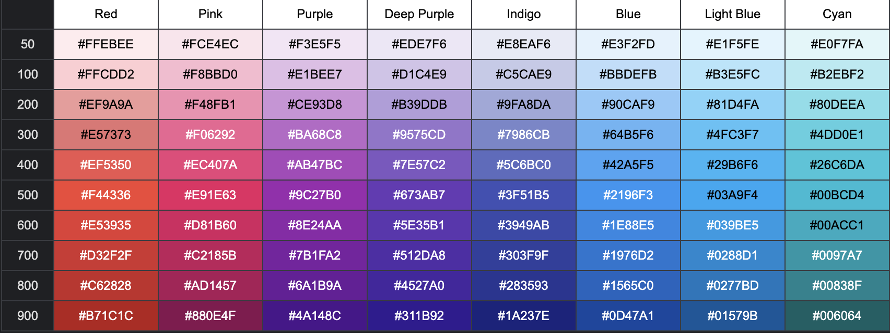

# Material Design Colors by Google

Material color tokens and Material 3 style color schemes for multiple platforms.

> Repository layout: one token source, platform package folders for iOS, React Native, and Python.
> Android is intentionally not packaged; use official Jetpack Compose Material 3 `ColorScheme` APIs on Android.


---

This project keeps the original Material Design 2 palette constants such as `pink400` and `tealA700`, and adds Material 3 role-based color schemes modeled after Compose Material 3:

```text
MaterialTheme
  colorScheme
    primary
    onPrimary
    primaryContainer
    surface
    onSurface
    surfaceContainerHighest
    error
    outline
```

Android apps should use the official Compose Material 3 APIs directly, including `dynamicLightColorScheme()`, `dynamicDarkColorScheme()`, and `MaterialTheme.colorScheme`: [Android Developers - Material 3 in Compose](https://developer.android.com/develop/ui/compose/designsystems/material3?hl=ko#dynamic_color_schemes).

The default light/dark Material 3 schemes in this repository were generated from source color `#6750A4` with Google Material Color Utilities tonal spot behavior: [material-foundation/material-color-utilities](https://github.com/material-foundation/material-color-utilities).

## Installation

### Swift Package Manager

```swift
dependencies: [
  .package(url: "https://github.com/swift-man/MaterialDesignColor.git", from: "2.0.0")
]
```

Products:

| Product | Purpose |
| --- | --- |
| `MaterialDesignColor` | Backward-compatible SwiftUI product |
| `MaterialDesignColorCore` | Pure Swift palette and Material 3 theme model |
| `MaterialDesignColorSwiftUI` | `SwiftUI.Color` extensions and `Environment` theme support |
| `MaterialDesignColorUIKit` | `UIKit.UIColor` extensions |

## Usage

### iOS - SwiftUI

Material 2 palette constants remain available:

```swift
import SwiftUI
import MaterialDesignColor

Text("title")
  .foregroundStyle(Color.tealA700)
```

Material 3 color scheme roles are available through `MaterialTheme`:

```swift
import SwiftUI
import MaterialDesignColorSwiftUI

let theme = MaterialTheme.dark

Text("Hello")
  .foregroundStyle(theme.colorScheme.primary.color)
  .background(theme.colorScheme.surface.color)
```

You can also place a theme in the SwiftUI environment:

```swift
struct ExampleView: View {
  @Environment(\.materialTheme) private var theme

  var body: some View {
    Text("Hello")
      .foregroundStyle(theme.colorScheme.onSurface.color)
      .background(theme.colorScheme.surface.color)
  }
}
```

### iOS - UIKit

```swift
import MaterialDesignColorUIKit

let scheme = MaterialColorScheme.baseline(.light)

label.textColor = scheme.onSurface.uiColor
button.backgroundColor = scheme.primary.uiColor
```

### React Native - Expo

The React Native package is pure TypeScript and does not require native modules, config plugins, or Expo prebuilds.

```ts
import { createMaterialTheme } from "@swift-man/material-design-color";

const theme = createMaterialTheme({ dark: false });

const color = theme.colorScheme.primary;
```

```tsx
import { createMaterialTheme } from "@swift-man/material-design-color";

const theme = createMaterialTheme({ dark: true });

export function Example() {
  return (
    <View style={{ backgroundColor: theme.colorScheme.surface }}>
      <Text style={{ color: theme.colorScheme.onSurface }}>Hello</Text>
    </View>
  );
}
```

Legacy palette constants are also available:

```ts
import { colors } from "@swift-man/material-design-color";

const backgroundColor = colors.pink400;
```

### Python

Python exposes the same Material 3 roles with Python-style field names.

```python
from material_design_color import create_theme

theme = create_theme(dark=True)

primary = theme.color_scheme.primary.hex
surface = theme.color_scheme.surface.hex
on_surface = theme.color_scheme.on_surface.hex
```

Legacy palette constants are also available:

```python
from material_design_color import MaterialColors, colors

hex_value = colors.pink400
rgb = MaterialColors.BLUE_300.rgb
```

## Repository Layout

```text
MaterialDesignColor/
  Package.swift                         # Swift Package Manager entry point
  README.md
  LICENSE

  tokens/
    material-colors.json                # Material 2 legacy palette
    material3/
      color-scheme-roles.json           # Compose-style role names
      baseline-color-schemes.json       # Light/dark baseline schemes
    schema.json

  packages/
    ios/
      Sources/
        MaterialDesignColorCore/
        MaterialDesignColorSwiftUI/
        MaterialDesignColorUIKit/
      Tests/

    react-native/
      package.json
      src/

    python/
      pyproject.toml
      src/material_design_color/
      tests/

  examples/
    ios-swiftui/
    ios-uikit/
    expo/
    python/

  tools/
    codegen/
```

All generated platform sources are produced from `tokens/`:

```bash
ruby tools/codegen/generate.rb
```

CI checks that generated files are up to date:

```bash
ruby tools/codegen/generate.rb --check
```

## Android

No Android artifact is published from this repository.

For Android, prefer official Jetpack Compose Material 3:

```kotlin
val colorScheme = if (darkTheme) {
  dynamicDarkColorScheme(context)
} else {
  dynamicLightColorScheme(context)
}

MaterialTheme(colorScheme = colorScheme) {
  // Use MaterialTheme.colorScheme.primary, surface, onSurface, ...
}
```

This keeps Android aligned with platform dynamic color behavior instead of shipping a parallel fixed-color package.

## Release Strategy

Recommended initial strategy: one repository tag for all non-Android packages.

```text
v2.0.0
```

Each package can publish its own artifact from that same tag:

| Platform | Folder | Registry |
| --- | --- | --- |
| iOS | root `Package.swift` + `packages/ios` | Swift Package Manager |
| React Native | `packages/react-native` | npm |
| Python | `packages/python` | PyPI |

If platform release cycles become very different later, use platform-prefixed tags:

```text
ios-v2.1.0
react-native-v1.2.0
python-v1.0.0
```

## Material Palette Color Tool

* [COLOR TOOL](https://m2.material.io/resources/color/#!/?view.left=0&view.right=0)


